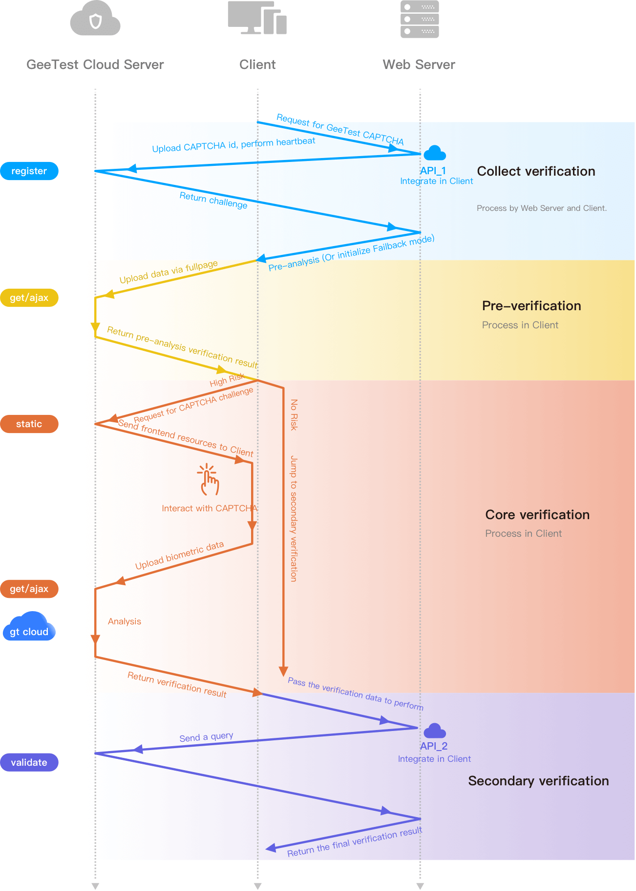

# react-native-geetest-module

A React Native GeeTest module for gt3 that can protect server endpoints.

## Installation

```sh
npm install react-native-geetest-module
```

## Usage

This module requires a server with register (API1) and validation (API2) endpoints.

Documentation from Geetest is provided [here](https://docs.geetest.com/captcha/deploy/server/node)

Set up the module in the component that uses Geetest
```js
import * as React from "react"
import {NativeModules, NativeEventEmitter} from "react-native"
import GeetestModule from "react-native-geetest-module";

// ...

const onGeetestDialogResultListener = React.useRef<EventSubscription>()
const onGeetestFailedListener = React.useRef<EventSubscription>()

// ...

React.useEffect(() => {
  GeetestModule.setUp()

  const eventEmitter = new NativeEventEmitter(NativeModules.GeetestModule)

  onGeetestDialogResultListener.current = eventEmitter.addListener(
    "GT3-->onDialogResult-->",
    (event) => {
      const parsedDialogResult = JSON.parse(event.result)
      console.log( "GT3-->onDialogResult-->", parsedDialogResult)
    },
  )

  onGeetestFailedListener.current = eventEmitter.addListener(
    "GT3-->onFailed-->",
    (event) => {
      console.log("GT3-->onFailed->", event.error)
    },
  )

  return () => {
    GeetestModule.tearDown()

    onGeetestDialogResultListener.current?.remove()
    onGeetestFailedListener.current?.remove()
  }
}, [])
```

Call the module with the results from the register request as a json string
```js
GeetestModule.handleRegisteredGeeTestCaptcha(/*
  JSON.stringify({
    success,
    challenge,
    gt,
    new_captcha,
  })
*/)
```

Then use the parsedDialogResult to validate a call to your server's endpoint. 

See the [example](example/src/App.tsx).

## Contributing

See the [contributing guide](CONTRIBUTING.md) to learn how to contribute to the repository and the development workflow.

## License

MIT
